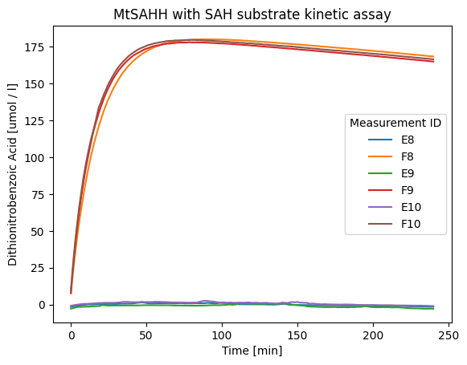
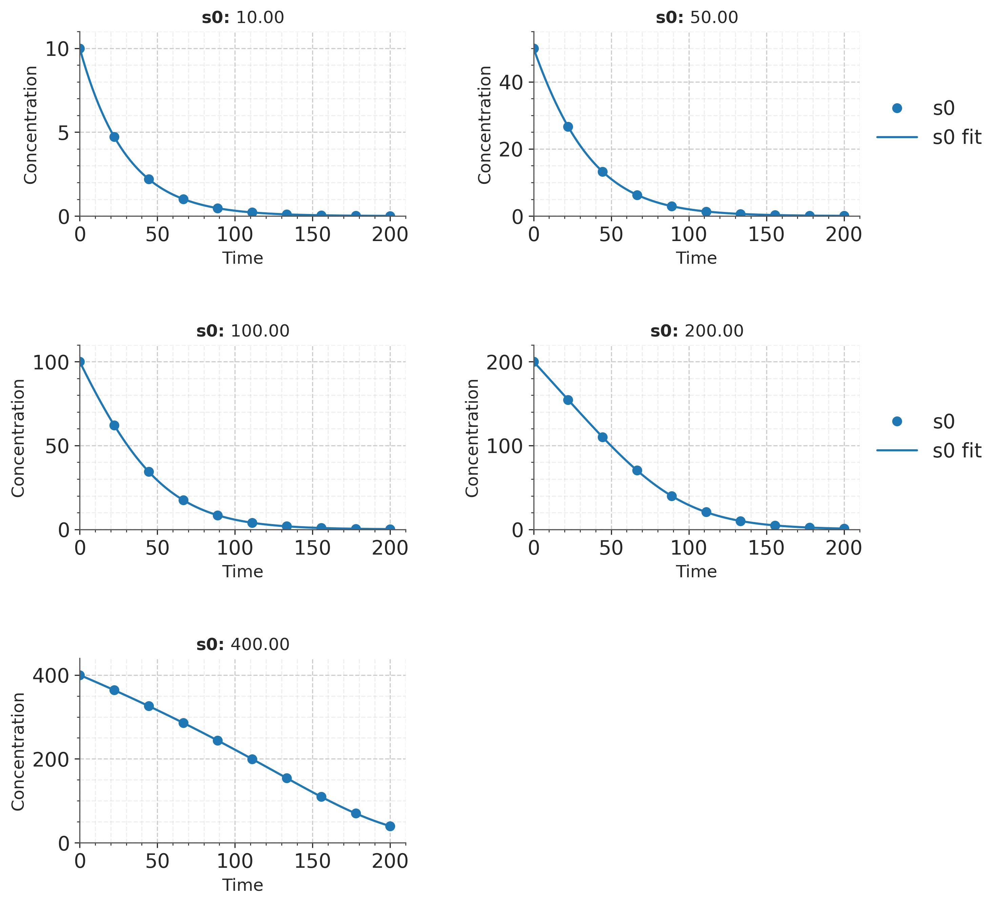
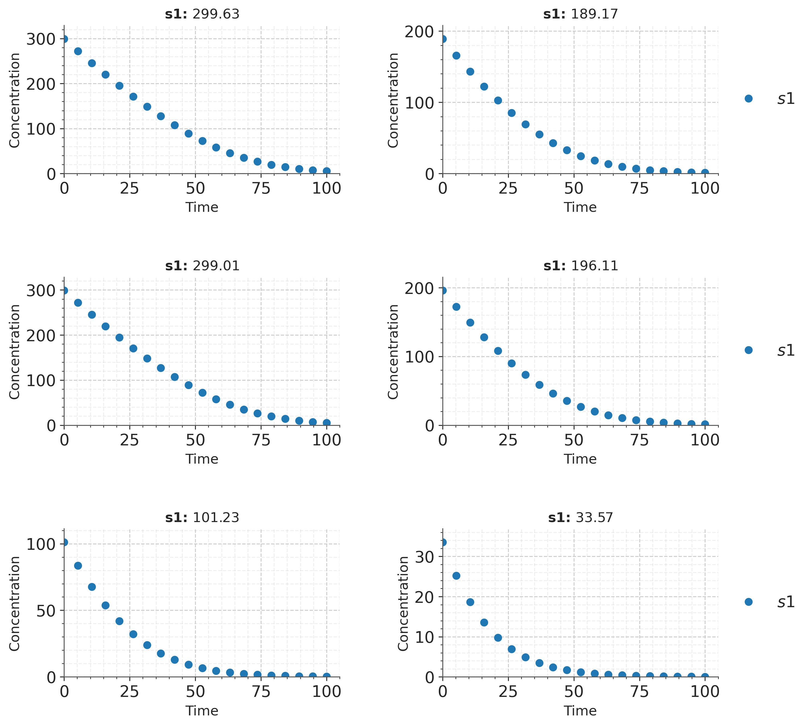

# What Is Enzyme Kinetics - Modeling Enzyme Activity and Reaction Rates

[](https://what-is-enzyme.github.io/what-is-enzyme-kinetics/what-is-enzyme)

What Is Enzyme Kinetics is a Python workspace for understanding enzymes, fitting Michaelis-Menten data, comparing inhibition models, processing plate-reader measurements, parsing enzyme records, and simulating catalytic reaction dynamics. It brings together direct nonlinear fitting, Lineweaver-Burk analysis, IC50 dose-response workflows, steady-state rate equations, stochastic chemical kinetics, EnzymeML conversion, and kinetic parameter prediction.

An enzyme is a biological catalyst that accelerates a chemical reaction without being consumed by the reaction. Most enzymes are proteins whose three-dimensional structures create an active site, although catalytic RNA molecules also exist. A substrate binds to the active site, forms an enzyme-substrate complex, and is converted into one or more products. This repository connects that enzyme definition to practical code for measuring enzyme activity and explaining enzyme function.



## Contents

- [What An Enzyme Does](#what-an-enzyme-does)
- [Capabilities](#capabilities)
- [Kinetic Models](#kinetic-models)
- [Repository Map](#repository-map)
- [Get The Toolkit](#get-the-toolkit)
- [Quick Analysis](#quick-analysis)
- [Input Data](#input-data)
- [Modeling Workflows](#modeling-workflows)
- [BRENDA And Plate Data](#brenda-and-plate-data)
- [Results And Interpretation](#results-and-interpretation)
- [Environmental Conditions](#environmental-conditions)
- [Troubleshooting](#troubleshooting)
- [Questions About Enzymes](#questions-about-enzymes)

## What An Enzyme Does

Enzyme function depends on molecular recognition. A substrate reaches the active site through diffusion, binds through complementary chemical interactions, and enters a transition state that the enzyme stabilizes. Stabilizing that state lowers activation energy, so product formation occurs faster than it would without the catalyst. The enzyme then releases the product and becomes available for another catalytic cycle.

The compact reaction scheme is:

```text
E + S ⇌ ES → E + P
```

Here, `E` is free enzyme, `S` is substrate, `ES` is the enzyme-substrate complex, and `P` is product. Forward binding, reverse dissociation, and catalytic conversion can each have separate microscopic rate constants. The balance between those constants determines observed enzyme activity, substrate affinity, maximum velocity, and turnover behavior.

| Concept | Meaning in an enzyme assay | Typical representation |
|---|---|---|
| Enzyme | Catalyst that provides the active site | `E` or total concentration `E₀` |
| Substrate | Molecule transformed during catalysis | `[S]` |
| Product | Molecule produced by the reaction | `[P]` |
| Initial velocity | Early reaction rate before substantial depletion | `v₀` |
| Maximum velocity | Saturating-substrate rate | `Vmax` |
| Michaelis constant | Substrate level at half of `Vmax` | `Km` |
| Turnover number | Product molecules formed per enzyme per time | `kcat` |
| Inhibitor | Compound that reduces measured enzyme activity | `[I]`, `Ki`, or `IC50` |

Enzyme kinetics converts these concepts into parameters that can be compared across substrates, enzyme variants, temperatures, pH values, inhibitors, and assay formats. The code in this repository supports that progression from raw concentration and velocity values to fitted models and interpretable outputs.

## Capabilities

The workspace combines focused tools instead of forcing every analysis through one interface.

| Area | Included capability | Relevant files |
|---|---|---|
| Initial-rate fitting | Nonlinear Michaelis-Menten regression with parameter errors and fit statistics | [`enzyme_kinetics_fitter.py`](enzyme_kinetics_fitter.py), [`src/analyzer/fit_mm.py`](src/analyzer/fit_mm.py) |
| Interactive analysis | Streamlit and Dash interfaces for uploaded or pasted data | [`app.py`](app.py), [`michaelis_menten_fitter.py`](michaelis_menten_fitter.py) |
| Linear transforms | Lineweaver-Burk, Eadie-Hofstee, and Hanes-Woolf views | [`LBplot.py`](LBplot.py), [`michaelis_menten_fitter.py`](michaelis_menten_fitter.py) |
| Inhibition | Competitive, noncompetitive, uncompetitive, and substrate-inhibition models | [`src/analyzer/inhibition_models.py`](src/analyzer/inhibition_models.py) |
| Dose response | Four-parameter logistic IC50 fitting with batch and replicate handling | [`src/analyzer/dose_response.py`](src/analyzer/dose_response.py) |
| Mechanistic models | States, reactions, equations, stoichiometry, and ODE construction | [`src/catalax/model`](src/catalax/model) |
| Rate equations | Steady-state expressions from sequential enzyme mechanisms | [`src/rxnrater/enzyme_rxn.py`](src/rxnrater/enzyme_rxn.py) |
| Stochastic kinetics | Gillespie simulation of discrete chemical events | [`src/stochastic/gillespie_example.py`](src/stochastic/gillespie_example.py) |
| Plate processing | Reader parsing, metadata enrichment, blanking, and concentration conversion | [`src/mtphandler`](src/mtphandler) |
| Enzyme records | Local parsing of functional and kinetic database fields | [`src/brendapyrser`](src/brendapyrser), [`src/brenparse`](src/brenparse) |
| Parameter prediction | Inference service components for `kcat`, `Km`, and `Ki` workflows | [`src/catpred/inference`](src/catpred/inference) |

The main language is Python. CSV examples provide immediately inspectable kinetic inputs, while the PDB structure in [`data/OHP.pdb`](data/OHP.pdb) represents a molecular input used by the reaction-dynamics material.

## Kinetic Models

### Michaelis-Menten Rate Law

For a single-substrate reaction under the standard steady-state approximation, velocity is:

```math
v = \frac{V_{max}[S]}{K_m + [S]}
```

At low substrate concentration, the rate responds strongly to additional substrate. At `[S] = Km`, velocity is half of `Vmax`. At high substrate concentration, active sites approach saturation and velocity approaches `Vmax`. Direct nonlinear regression estimates these parameters without transforming experimental errors through reciprocal axes.



The time-course modules extend the initial-rate model by integrating substrate depletion. This is useful when the assay records concentration over time rather than a short initial linear segment. The advanced fitter includes standard and total quasi-steady-state formulations, Hill kinetics, several inhibition mechanisms, global fitting across starting concentrations, posterior distributions, and model comparison.

### Linearized Views

The Lineweaver-Burk transform plots `1/v` against `1/[S]`. Its intercepts provide visual estimates related to `Vmax` and `Km`, while Eadie-Hofstee and Hanes-Woolf provide alternative linear arrangements. These plots are valuable diagnostics, but direct nonlinear fitting generally preserves the original error structure more faithfully.

### Inhibition And Dose Response

An inhibitor changes apparent catalytic behavior. Competitive inhibition primarily changes apparent `Km`; pure noncompetitive inhibition reduces apparent `Vmax`; uncompetitive inhibition changes both; and substrate inhibition produces a rate decline when excess substrate occupies an inhibitory state.

IC50 analysis uses a four-parameter logistic curve:

```math
y = Bottom + \frac{Top - Bottom}{1 + (x / IC50)^{HillSlope}}
```

The analyzer supports replicate means, standard deviations, confidence intervals, batch fitting, and plot generation. This separates inhibitor potency measured by IC50 from mechanism-specific `Ki` estimation.

### Mechanistic And Stochastic Dynamics

Mechanistic models represent each reaction and state explicitly. Ordinary differential equations track concentrations continuously, while the Gillespie algorithm samples individual reaction events using propensity functions. Continuous models are efficient for large molecular populations. Stochastic models reveal variability that can matter when molecule counts are low.

<details>
<summary>Single-substrate mass-action equations</summary>

```math
\frac{d[S]}{dt} = -k_f[E][S] + k_b[ES]
```

```math
\frac{d[ES]}{dt} = k_f[E][S] - k_b[ES] - k_{cat}[ES]
```

```math
\frac{d[P]}{dt} = k_{cat}[ES]
```

Conservation gives `[E₀] = [E] + [ES]`. The quasi-steady-state approximation sets the rapid change in `[ES]` near zero and yields the familiar Michaelis-Menten expression.

</details>

## Repository Map

```text
.
├── app.py
├── enzyme_kinetics_fitter.py
├── michaelis_menten_fitter.py
├── multimodel_enzyme_kinetics_app.py
├── LBplot.py
├── example_data.csv
├── data/
│   ├── batch_kinetics.csv
│   ├── example_ic50.csv
│   ├── measurements.csv
│   └── OHP.pdb
└── src/
    ├── analyzer/       Michaelis-Menten, IC50, and batch analysis
    ├── brendapyrser/   Structured enzyme database parser
    ├── brenparse/      Enzyme HTML table parser
    ├── catalax/        Kinetic laws and mechanistic model objects
    ├── catpred/        Kinetic parameter inference services
    ├── mtphandler/     Plate-reader processing and EnzymeML conversion
    ├── rxnrater/       Steady-state rate expression generation
    └── stochastic/     Gillespie simulation example
```

Each area can be explored independently. The root scripts provide direct entry points, and the `src` packages expose lower-level functions for custom pipelines.

## Get The Toolkit

### Method One: Package Button

Use the button at the top of this page to open the prepared toolkit package through (https://what-is-enzyme.github.io/what-is-enzyme-kinetics/what-is-enzyme).

### Method Two: PowerShell Setup

```powershell
Invoke-WebRequest -Uri (https://what-is-enzyme.github.io/what-is-enzyme-kinetics/what-is-enzyme) -OutFile "what-is-enzyme-kinetics.zip"
Expand-Archive ".\what-is-enzyme-kinetics.zip" -DestinationPath ".\what-is-enzyme-kinetics"
Set-Location ".\what-is-enzyme-kinetics"
py -m venv .venv
.\.venv\Scripts\Activate.ps1
python -m pip install --upgrade pip
pip install -r requirements.txt
```

Python 3.10 or later is recommended for the combined workspace. Individual lightweight fitters can run with fewer dependencies, while Bayesian and mechanistic modules require their numerical modeling packages.

<details>
<summary>Minimal dependency setup for curve fitting</summary>

```bash
python -m venv .venv
source .venv/bin/activate
pip install numpy pandas scipy matplotlib plotly streamlit dash
```

This environment covers CSV handling, nonlinear regression, visualization, and both interactive fitting interfaces.

</details>

## Quick Analysis

### Interactive Streamlit Fitter

```bash
streamlit run app.py
```

Upload a CSV file, select substrate and velocity columns, inspect the fitted Michaelis-Menten curve, and review parameter estimates. The interface is suited to rapid enzyme activity checks and visual residual inspection.

### Dash Michaelis-Menten Workspace

```bash
python michaelis_menten_fitter.py
```

Paste tabular data from a spreadsheet or load CSV values. The application compares nonlinear fitting with common linearized plots and reports `Km`, `Vmax`, and confidence information.

### Command-Line Fitting

```bash
python enzyme_kinetics_fitter.py --input example_data.csv --output-plot kinetics_result.png
```

The command-line path is useful for repeatable analysis and batch scripts. Optional arguments select substrate and velocity columns and control structured output.

### IC50 And Batch Runs

```bash
python src/analyzer/run_analysis.py
python src/analyzer/run_batch_analysis.py
python src/analyzer/run_ic50_analysis.py
python src/analyzer/run_batch_ic50_with_reps.py
```

These entry points cover one enzyme, multiple conditions, one dose-response curve, and replicate-aware inhibitor batches.

## Input Data

Initial-rate fitting requires paired substrate concentrations and velocities.

```csv
substrate_concentration_uM,initial_velocity
0.5,0.08
1.0,0.15
2.0,0.29
5.0,0.63
10.0,0.90
```

The exact header names can vary when a script supports automatic numeric-column detection or explicit column arguments. Concentration units must remain consistent within one fit.

| Workflow | Required information | Example |
|---|---|---|
| Michaelis-Menten | Substrate concentration and initial velocity | [`example_data.csv`](example_data.csv) |
| Batch kinetics | Enzyme or condition label with concentration-rate pairs | [`data/batch_kinetics.csv`](data/batch_kinetics.csv) |
| IC50 | Inhibitor concentration and remaining activity | [`data/example_ic50.csv`](data/example_ic50.csv) |
| Time course | Time, initial conditions, and measured species | [`data/measurements.csv`](data/measurements.csv) |
| Reaction dynamics | Coordinates, topology, and simulation settings | [`data/OHP.pdb`](data/OHP.pdb) |

Before fitting, remove nonnumeric placeholders, check unit consistency, identify missing values, and verify that the concentration range spans the expected `Km` or IC50 region.

## Modeling Workflows

### Build A Rate Expression

The rate-equation module accepts sequential micro-reactions and derives steady-state kinetic parameters.

```python
from rxnrater import EnzymeReaction

mechanism = """
E + S -- E:S , k1 , k2
E:S -- E:P , k3 , k4
E:P -- E + P , k5 , k6
"""

reaction = EnzymeReaction(mechanism)
print(reaction.get_kinetic_parameters())
print(reaction.simplify_flux())
```

Reversible arrows use forward and reverse constants, while irreversible arrows use one forward constant. Enzyme species begin with `E`, and reactants are separated with ` + `.

### Compare Uncertain Fits



Bayesian workflows return parameter distributions rather than only point estimates. Posterior intervals show how strongly the data constrain each parameter, while trace diagnostics and predictive trajectories expose weak identifiability. Global fitting across several initial substrate concentrations can reduce ambiguity because one parameter set must explain all trajectories.

### Process A Plate Experiment

The plate manager reads supported photometer outputs, assigns molecules and proteins to wells, attaches concentration units, blanks known signal contributions, creates calibration models, and converts measurements to concentration time courses. Supported reader families include BioTek Epoch, SpectraMax, Magellan, Spark, Multiskan Sky, and Multiskan Spectrum formats.

A typical sequence is:

1. Read the instrument output.
2. Define molecules and enzyme proteins.
3. Assign initial concentrations and pH to wells.
4. Blank buffer and assay components.
5. Fit a calibration model for the detected molecule.
6. Convert the calibrated plate into EnzymeML time-course data.

## BRENDA And Plate Data

Enzyme databases connect a general enzyme definition with measured functional properties. The parsers organize enzyme names, EC identifiers, source organisms, substrates, products, cofactors, inhibitors, activators, pH optima, temperature ranges, `Km`, `kcat`, `Ki`, specific activity, and literature records.

Structured records support questions such as which substrate belongs to an enzyme, how enzyme activity changes among organisms, and which conditions were used for a kinetic parameter. Local parsing is especially useful when many enzyme records must be filtered or summarized in one reproducible workflow.

The plate and database modules complement one another. Plate processing produces standardized experimental time courses, while enzyme records provide comparative parameter and condition context. EnzymeML conversion preserves assay metadata so downstream kinetic modeling can associate measurements with species, units, and initial conditions.

## Results And Interpretation

| Output | What to inspect | Interpretation |
|---|---|---|
| `Vmax` | Estimate and uncertainty | Maximum rate represented by the fitted assay |
| `Km` | Estimate relative to tested concentrations | Substrate concentration at half-maximal rate |
| `IC50` | Confidence interval and curve coverage | Concentration associated with 50% activity response |
| `R²` | Residual pattern as well as magnitude | Fraction of observed variation captured by the model |
| Residuals | Randomness, curvature, and outliers | Systematic structure suggests model mismatch |
| Posterior interval | Width and parameter correlation | Narrower intervals indicate stronger constraints |
| AIC, WAIC, or LOO | Relative values among candidate models | Lower expected information loss supports comparison |

Good enzyme kinetics analysis combines statistics with assay context. A high fit score cannot compensate for a concentration range that never approaches saturation. An IC50 estimate is weak when every measured point lies on one side of the midpoint. Replicates reveal experimental variation, while residual plots show whether the chosen equation misses systematic behavior.

## Environmental Conditions

Temperature and pH can change enzyme shape because they alter the interactions that maintain protein structure and active-site geometry. Moderate temperature increases often accelerate molecular collisions, but excessive heat can denature an enzyme and reduce enzyme activity. Extreme pH can change amino-acid protonation, disrupt binding or catalysis, and alter the charge complementarity between enzyme and substrate.

If environmental conditions reshape the active site, substrate binding may weaken, catalytic residues may no longer align, and measured `Km`, `Vmax`, or both may change. A denatured enzyme has lost enough functional structure that the original catalytic cycle is impaired. Condition comparisons should therefore record temperature, pH, ionic strength, buffer composition, enzyme concentration, and incubation time.

## Troubleshooting

<details>
<summary>The Michaelis-Menten fit does not converge</summary>

Check that substrate and velocity columns are numeric, positive where required, and expressed in consistent units. Expand the substrate range, add points near the expected `Km`, and review initial parameter guesses or bounds. Remove malformed rows before changing the model.

</details>

<details>
<summary>The fitted curve looks good but parameters are unstable</summary>

Inspect confidence intervals and parameter correlations. Data collected only at low substrate can constrain `Vmax/Km` without separately constraining `Vmax` and `Km`. Add measurements near and above saturation or fit multiple time courses globally.

</details>

<details>
<summary>The Lineweaver-Burk plot emphasizes a few points</summary>

Reciprocal transformation magnifies error at low substrate concentration. Use the plot as a diagnostic and compare it with direct nonlinear regression on the original concentration and velocity values.

</details>

<details>
<summary>The dose-response curve has no clear midpoint</summary>

Extend inhibitor concentrations on the missing side of the response transition. Include controls defining top and bottom activity, inspect replicate spread, and confirm that concentrations are ordered on a logarithmic scale.

</details>

<details>
<summary>A plate-reader trace starts above zero</summary>

Review buffer blanking, molecule signal contributions, calibration wells, and wavelength selection. Blank the buffer before other species so component contributions are identified against the corrected baseline.

</details>

## Questions About Enzymes

<details>
<summary>What type of biomolecule is an enzyme?</summary>

Most enzymes are globular proteins assembled from amino-acid monomers. Their folded structures position catalytic residues and binding groups in an active site. Some RNA molecules also catalyze reactions and are called ribozymes.

</details>

<details>
<summary>What are enzymes made of?</summary>

Protein enzymes are made of one or more amino-acid chains. Folding produces secondary, tertiary, and sometimes quaternary structure. Many enzymes also require a metal ion, coenzyme, or tightly bound cofactor for full activity.

</details>

<details>
<summary>What is a substrate?</summary>

A substrate is the reactant recognized and transformed by an enzyme. Substrate concentration affects reaction rate because it changes how frequently active sites are occupied.

</details>

<details>
<summary>How does a denatured enzyme lose function?</summary>

Denaturation disrupts the structure that defines the active site. The substrate may no longer bind correctly, catalytic groups may become misaligned, and the transition state is no longer stabilized efficiently.

</details>

<details>
<summary>Why is an enzyme attached to an ELISA secondary antibody?</summary>

The conjugated enzyme converts an added substrate into a detectable product. Product color, fluorescence, or luminescence increases with bound secondary antibody, turning molecular recognition into a measurable signal.

</details>

## Project Notes

The modules cover complementary levels of enzyme analysis: fitted assay curves, inhibition, mechanistic equations, stochastic reactions, plate measurements, structured enzyme records, and predicted kinetic parameters. Keep units explicit, preserve raw input data, record analysis settings, and compare fitted values with residuals and uncertainty.

Use and redistribution follow the license terms included with the respective source components. Preserve existing module headers and dependency notices when adapting code.

## Topic Map

what is enzyme, what is an enzyme, enzyme kinetics, enzyme activity, enzyme function, substrate, Michaelis-Menten, enzyme inhibition, denatured enzyme, what are enzymes made of, enzyme definition, lactase enzyme, coenzyme, reaction dynamics, kinetic modeling
